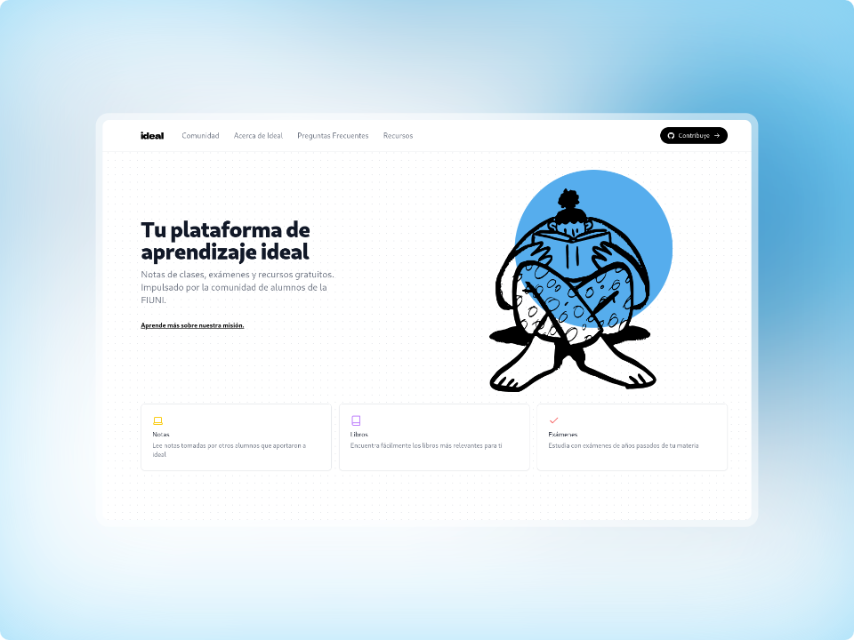

# Ideal, tu plataforma de aprendizaje libre



Configurar para iniciar con el desarrollo

```bash
npm install -g pnpm
pnpm install
```

Para iniciar en local

```bash
pnpm run dev
```

Admin UI: [https:/ideal-7m3.pages.dev/keystatic](https:/ideal.fiuni.edu.py/keystatic)

Homepage: [https:/ideal-7m3.pages.dev/](https:/ideal.fiuni.edu.py/)
